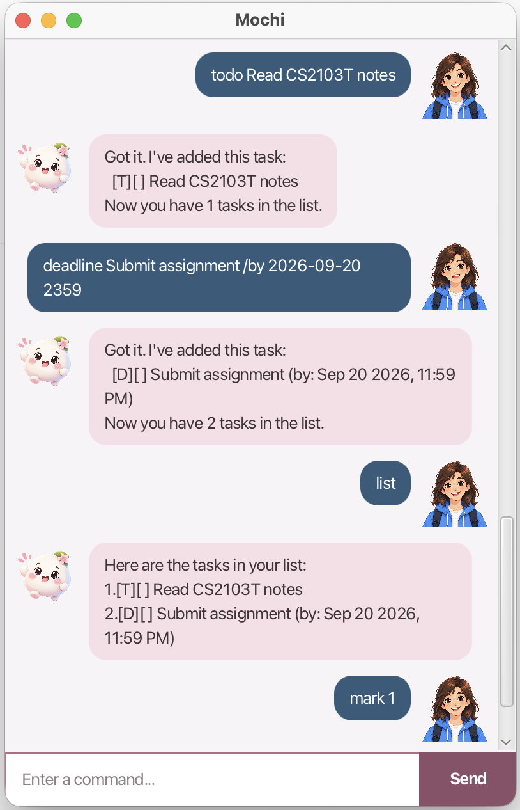

# Mochi User Guide

// Update the title above to match the actual product name



// Product intro goes here

## Command aliases

Mochi accepts these shorter alternatives to the existing commands:

| Alias | Existing command |
|-------|------------------|
| `t`   | `todo`           |
| `d`   | `deadline`       |
| `e`   | `event`          |
| `l`   | `list`           |
| `f`   | `find`           |

Use the same arguments as the corresponding existing command. For example,
`t read book` behaves exactly like `todo read book`.

## Adding deadlines

// Describe the action and its outcome.

// Give examples of usage

Example: `keyword (optional arguments)`

// A description of the expected outcome goes here

```
expected output
```

## Feature ABC

// Feature details


## Feature XYZ

// Feature details
